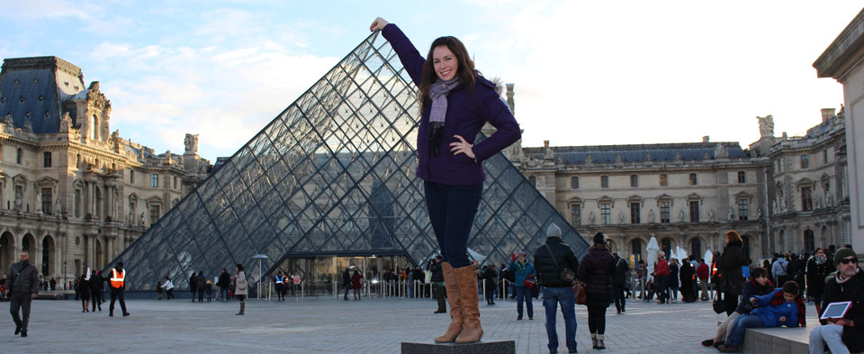

I’m a graphic designer, aspiring photographer and coffee lover.

I live and work in the vibrant city of Austin, TX. I have a passion for good design and nothing makes me happier than finding it in unexpected places around town. I currently work for TextureMedia, Inc. as their in house Graphic Designer, where I focus on designing all marketing and social materials. In my spare time I volunteer for the Big Brother Big Sister Organization, hang out with friends and find new projects I want to dabble in. Overall I like staying busy.

<!-- This is the base Jekyll theme. You can find out more info about customizing your Jekyll theme, as well as basic Jekyll usage documentation at [jekyllrb.com](http://jekyllrb.com/)

You can find the source code for the Jekyll new theme at: [github.com/jglovier/jekyll-new](https://github.com/jglovier/jekyll-new)

You can find the source code for Jekyll at [github.com/jekyll/jekyll](https://github.com/jekyll/jekyll)
 -->